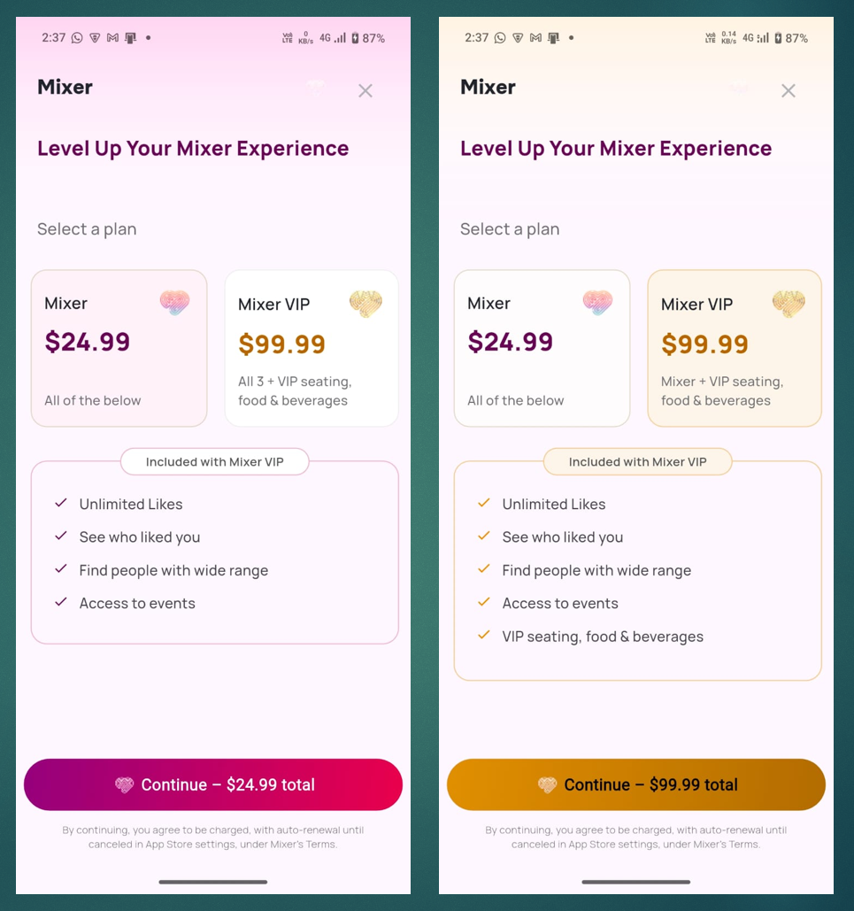
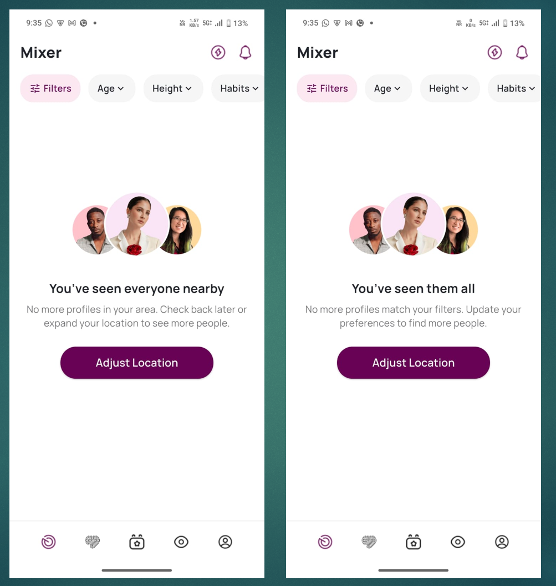

# Internship Assignment
**By: Sandeep Sisodiya**

---

## 📌 Project Overview
This project is a **Flutter-based mobile application** developed as part of the internship assignment.  
The app demonstrates UI implementation, asset management, and the use of external packages like `google_fonts` for styling.

---

## 🚀 Features
- Beautiful UI built with Flutter.
- Asset-based images integrated into the app.
- Custom fonts using Google Fonts package.
- Responsive and scalable design.

---

## 🛠️ Approach & Implementation
1. **Project Setup**:
    - Initialized a new Flutter project (`internship_assignment`).
    - Configured the `pubspec.yaml` file to include dependencies and assets.

2. **UI Design**:
    - Used **Material Design** for layout structure.
    - Integrated image assets (icons, homepage images, buttons).
    - Implemented custom fonts for modern UI feel.

3. **Development Flow**:
    - Designed homepage with multiple images.
    - Added icons and button-based assets for interactivity.
    - Ensured smooth performance across devices.

---

## 📦 Libraries & Tools Used
- **Flutter SDK** – Core framework.
- **Dart** – Programming language.
- **google_fonts** – To integrate custom fonts easily.
- **cupertino_icons** – iOS style icons.
- **Android Studio / VS Code** – Development environment.
- **Git & GitHub** – Version control.

---

## 📷 Screenshots
(Add your actual app screenshots here)

  

---

## 🎥 Demo Video
[Click here to watch the demo](https://drive.google.com/file/d/1jb5jHAUGhi4902JIEPaAV9F_qdNeE0k5/view?usp=sharing)

---

## ⚡ Challenges Faced & Solutions
- **Challenge 1**: Asset path issues in Flutter.
    - *Solution*: Carefully configured `pubspec.yaml` with correct indentation and relative paths.

- **Challenge 2**: Fonts not reflecting.
    - *Solution*: Used `google_fonts` package instead of manually adding fonts.

- **Challenge 3**: UI responsiveness across devices.
    - *Solution*: Used flexible widgets and Flutter’s layout system.

---

## 📌 Conclusion
This project showcases the ability to work with **Flutter, asset management, UI design, and package integration**.  
It reflects a solid understanding of building and styling cross-platform mobile applications.

---
